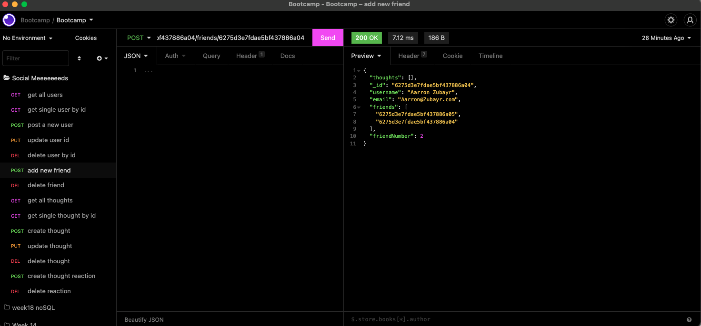
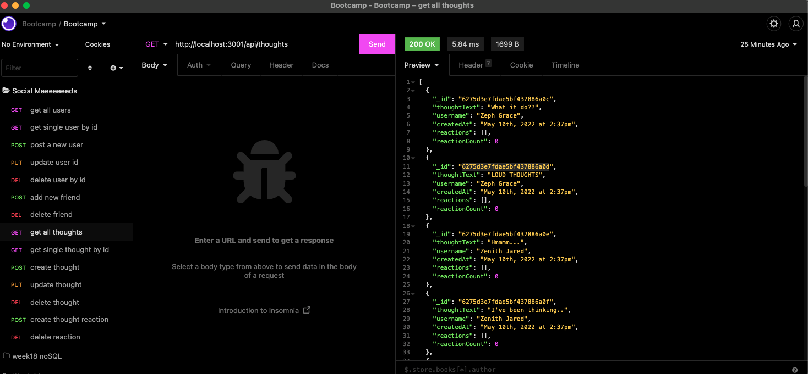
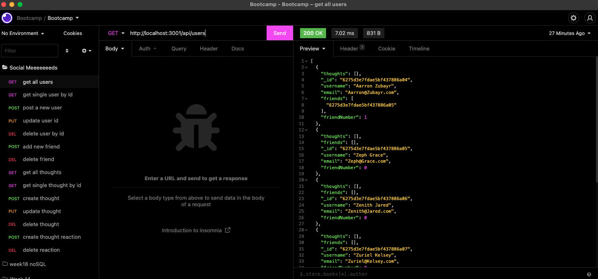
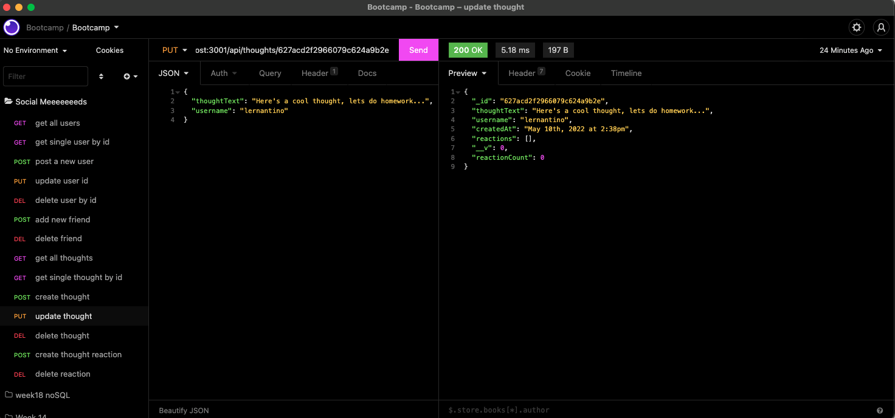

# social-meeeds-API

## Description

This homework is designed to allow the user store data with an API in MongoDB and Mongoose.

## Table of Contents

* [Installation
  ](#installation)  

* [Usage
  ](#usage)

* [Example
  ](#example)

* [Questions
  ](#questions)

## Installation

To install necessary dependencies, run the following command:

'''
npm i 
'''

## Usage

First, after installing all required dependencies, you will need to type "npm run start" in the terminal. You will also need the program Insomnia (or one similar) to communicate with your database. The user will be able to see all users, a single user, post new/update current/delete current users, see all thoughts, a single thought, post new/update current/delete current thoughts and be able to react to thoughts.  

## Example

An example video can be found at: https://youtu.be/BwNg8Yo3ed4

You can view the GitHub repo at: https://github.com/kylejames20/social-meeeds-API

## Questions

Please reach out with any questions via email at k.salmons@me.com. You can find more of my work here: [Kyle Salmons](https://github.com/kylejames20).